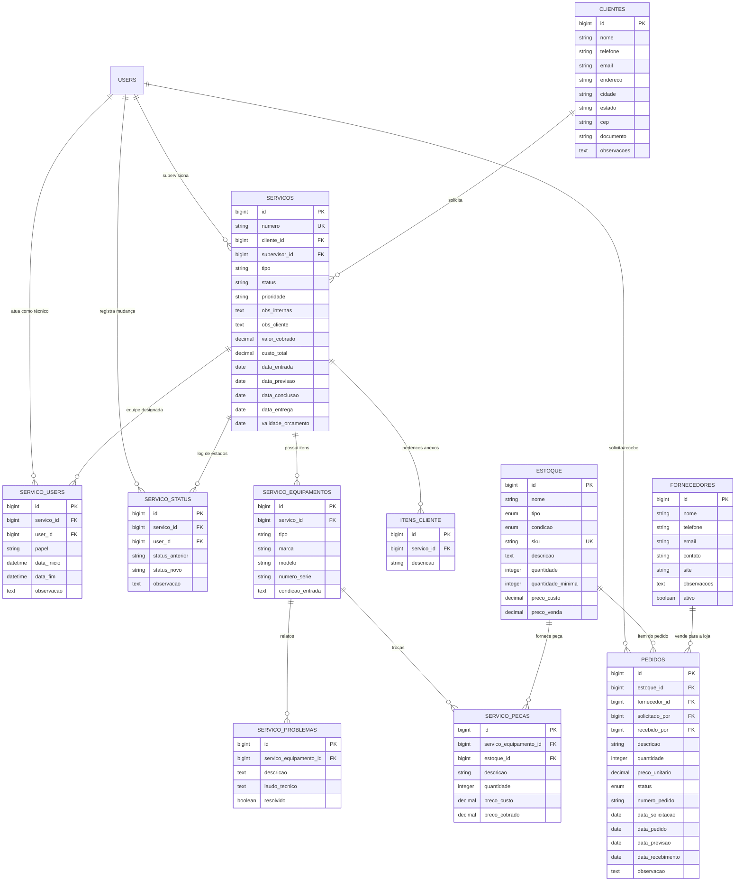

# 📊 Arquitetura de Dados - Serviço Fácil

Este guia serve como mapa para desenvolvedores realizarem manutenções e expansões no banco de dados.

---

## 1. Diagrama Técnico Completo (ERD)
Este diagrama usa a notação *Crow's Foot*. A ponta com "tridente" indica o lado **Muitos** e a linha reta indica o lado **Um**.

---

## 2. Dicionário de Chaves (Para Modificações)

Se você for alterar o banco, atente-se a estas conexões mestres:

| Tabela Origem | Tabela Destino | Chave Estrangeira (FK) | Comportamento ao Deletar |
| :--- | :--- | :--- | :--- |
| `clientes` | `servicos` | `cliente_id` | **CASCADE**: Deleta a OS se o cliente sumir. |
| `servicos` | `servico_equipamentos`| `servico_id` | **CASCADE**: Remove equipamentos ao excluir OS. |
| `estoque` | `servico_pecas` | `estoque_id` | **SET NULL**: Mantém o registro da peça na OS mesmo se o item sair do estoque. |
| `users` | `servicos` | `supervisor_id` | **SET NULL**: Mantém a OS mesmo se o usuário for excluído. |
| `servicos` | `servico_users` | `servico_id` | **CASCADE**: Remove vínculos de equipe ao excluir OS. |
| `servicos` | `servico_status` | `servico_id` | **CASCADE**: Remove histórico de status ao excluir OS. |

---

## 3. Cenários de Fluxo (Como as tabelas conversam)

### Exemplo: Fluxo de Peça e Estoque
1. O técnico identifica um problema em `servico_problemas`.
2. Ele adiciona uma peça em `servico_pecas`. 
   - Se a peça vem do seu armário, ela aponta para um `estoque_id`.
   - O campo `preco_venda` do `estoque` deve ser usado para preencher o `preco_cobrado` na OS.
   - O campo `preco_custo` do `estoque` deve ser copiado para `preco_custo` na `servico_pecas` para auditoria histórica.
3. Se não houver a peça:
   - Cria-se um registro em `pedidos` apontando para o `estoque_id` (que está zerado) e para um `fornecedor_id`.
   - Quando o `pedido` mudar o status para 'recebido', você deve somar a `quantidade` no `estoque`.

### Exemplo: Controle de Equipe
1. Uma OS em `servicos` possui um Supervisor fixo (`supervisor_id`).
2. Adicionalmente, múltiplos técnicos podem ser vinculados via `servico_users`.
   - O campo `papel` define a função (ex: 'técnico', 'auxiliar').
   - `data_inicio` e `data_fim` permitem rastrear o tempo dedicado.

---

## 4. Dicas para Futuras Alterações
- **Novos Campos**: Sempre que adicionar um valor monetário, use `decimal(10,2)`.
- **Soft Deletes**: Se planeja permitir "desfazer exclusões", precisará adicionar a coluna `deleted_at` nas tabelas principais (`clientes`, `servicos`, `estoque`).
- **Logs**: A tabela `servico_status` registra todas as transições de estado da OS, armazenando o `status_anterior` e `status_novo` para fins de auditoria.
